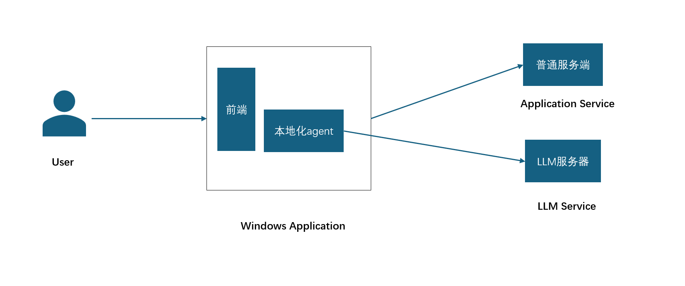

# yolk

开发好的项目，只需要两步，即可完成python(ai-agent)和前端react项目打包，一键打包成windows安装包。可以实现agent的本地化部署。
以及高效前端开发能力。


```text
┌──────────────────────────────────────────┐
│        Renderer（前端 UI）               │
│  模型选择、MCP 配置、权限、风险控制、记忆 │
└───────────────────▲──────────────────────┘
                    │
┌───────────────────┴──────────────────────┐
│        Electron Main（系统能力层）        │
│ 文件、对话框、剪贴板、沙箱、权限 API      │
└───────────────────▲──────────────────────┘
                    │
┌───────────────────┴──────────────────────┐
│        Python Agent（本地）               │
│ OpenManus(LangChain)、MCP、记忆、任务执行 │
└───────────────────▲──────────────────────┘
                    │
┌───────────────────┴──────────────────────┐
│        LLM（用户选择：本地/云端/MCP）      │
└──────────────────────────────────────────┘

```


## 项目的依赖安装

开发项目需要安装python和node。在conda的虚拟环境下，执行以下步骤。

* 安装node依赖

```shell
npm install
```

* 安装react依赖
  安装react的命令

```shell
npm install react react-dom
npm install --save-dev @types/react @types/react-dom
```

## 开发环境下面运行

```shell
npm run build
npm run dev
```

## 项目打包

1. 运行 python 下面的build.exe.bat
2. 运行shell:

````shell
npm run build:dev
````

```shell
conda create -n yolk python=3.11
conda activate yolk
```

## 核心功能
1. UI界面setting页面可以配置MCP服务器，用户可以自由的配置自己的MCP SERVER
2. UI界面Setting有一个页面给用户配置服务商的URL和密钥，也可以选择自己默认的aliyun
3. 用户可以配置一个WorkSpace,默认位置是在桌面上，用户可以自己手动配置，并且用户可以配置子目录的权限（readonly or write）
4. Setting页面可以查询到用户的软件，用户需要在这里给Agent对应的权限，然后Agent才能去操作软件
5. 需要实现一个核心的功能，用户可以打开邮件然后写好对应的body以及title，给用户审核。
6. Agent可以在WorkSpace里面操作文件，比如讲A文件的B列数据按照分组、聚合、提取的放到新的excel里面。

### 风险等级(Setting里面配置)
风险等级分为三类，默认分享等级为中级（medium）,前端有一个滑块，1为更灵活，5为模糊，10为精确.
* 每个动作都确认
* 只有高风险动作确认
* LLM 自己决定什么时候问人类

## Episodic Memory Compression (EMC)记忆压缩

**EMC记忆压缩** 接近人类记忆的压缩机制，按时间、主题、关键词组织，可以顺着线索还原当时的状态，不是简单的向量检索，而是结构化记忆。
人类记忆是压缩的、模糊的、线索化的、按时间衰减的；而大模型的上下文是线性的、昂贵的、容易遗忘的。
## 为什么大模型需要“记忆压缩”

因为模型无法长期记住上下文，无法存储大量历史，无法自动组织记忆，无法主动回忆，无法模拟“人类记忆的模糊性“
该算法着重解决：

* 长期记忆
  把用户的长期偏好、习惯、历史事件压缩成结构化记忆。
* 线索回溯
  模型可以根据关键词、主题、时间线“回忆”过去。
* 上下文重建
  当模型需要时，你可以把“压缩记忆”重新展开成“当时的状态”。
* 记忆衰减
  越久远的记忆越模糊，但仍保留关键线索。

## 为三重记忆机制

* 短期记忆（Short-term Memory）
* 中期记忆
* 长期记忆图谱

## 长期记忆图谱

### 记忆图谱(Memory Graph)

* 节点
  人物 事件 主题 决策 偏好
* 边
  时间顺序 因果关系 主题关联

### 记忆衰减（Memory Decay）

越久远的记忆： 权重降低 只保留关键词 删除细节 保留结论

### 记忆重建（Memory Reconstruction）

当模型需要时： 根据关键词 根据主题 根据时间线 把相关记忆重新组合成“当时的状态”。

## 数据结构

## 衰减函数

## 线索检索算法

## 回忆重建 prompt

## 文件组织结构

## 前端的安装包
```shell
npm install react-router-dom
```
## 产品路线
### 阶段 1：基础能力搭建（已完成 60%）
* 构建双 Agent 架构：
*  agent_stream.py（流式大模型）

* agent_tools.py（一次性工具 API）

* 建立 Electron ↔ Python 的 IPC 通道

* 支持流式输出、need_input、input_reply

* 支持工具调用（list_files、read_file 等）

* 支持本地模型运行（LLM Engine）

* 支持一键打包成安装包

* 配置文件从 EXE 分离，放入用户目录（可写）


### 阶段 2：意图解析 + 工具调用（核心能力）
用户自然语言 → LLM 解析意图

*  LLM 输出结构化指令（action + params）

* agent_tools.py 执行对应任务

* 支持任务类型：

* 创建会议

* 创建 Jira task

* Excel 自动化（读取、提取、合并）

* 文件操作

* 本地脚本执行

* 支持错误处理、重试、确认机制

* 支持“多步骤任务”（LLM 规划 → 工具执行 → 汇报）

### 阶段 3：本地记忆系统（Local Memory）
本地 memory.json（长期记忆）

记忆类型：

* 用户偏好（会议格式、Jira 项目、Excel 路径）

* 工作区信息

* 常用联系人

* 历史任务

* 自动记忆（LLM 判断哪些信息需要存储）

* 记忆检索（LLM 自动引用用户偏好）

* 记忆清理与权限控制

* 支持“用户可编辑记忆”

### 阶段 4：插件系统（Plugin System）
工具 API 抽象成插件接口

*  插件目录：plugins/

插件类型：

* Python 插件

* Node 插件

* HTTP 插件

* 插件 manifest（名称、权限、入口文件）

* 插件权限系统（文件、网络、执行）

* 插件热加载

* 插件市场（未来可扩展）

### 阶段 5：商业化与产品化
* 用户模型管理 UI（选择模型、参数调整）

* 权限 UI（文件、网络、执行权限）

* 工作区管理（项目、文档、知识库）

* 自动化任务系统（定时任务、触发器）

* Pro 版功能：

* 高级插件

* 企业级权限

* 日志审计

* 多模型协作

企业版：

* 内网部署

* 模型私有化

* 插件白名单

* 团队协作

* 插件市场分成模式


